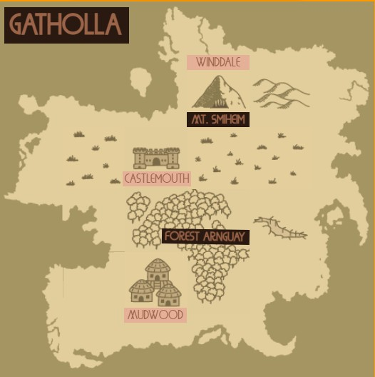
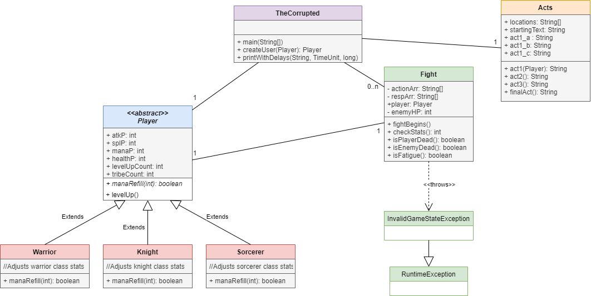

# The Corrupted
A turn based console game I programmed as a term project for my Design Patterns course.

## The Prologue
Gatholla Kingdom, biggest continent of Planet Enukha... Three different kinds live inside Gatholla: Humans, Orcs and Wizards. Gathollans mainly used to live on three major cities:
- Castlemouth; the glorious city of humans located in the middle of Gatholla.
- Winddale; A large wizard community above the clouds, highest point of the Mountain Smiheim which is located at the north of Gatholla.
- Mudwood, a mysterious town of orcs deep inside the Forest Arnguay.
Everything was going well for Gathollans, until the corruption started.

